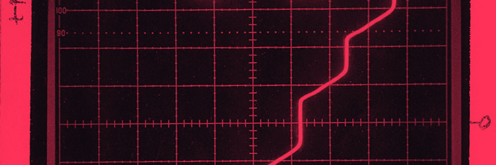

# JUAN NARANJO

**DSP engineer · musician · systems-minded builder**

I build tools where code becomes sound—and experiments become reliable systems.

## 01 / SIGNAL

I work at the boundary between musical ideas and the machinery that makes them audible: **real-time audio**, **creative developer tools**, and **AI-assisted engineering**. I like low-latency systems, inspectable automation, open creative tools, and strange ideas with good test benches.

Usually transmitting from Arch Linux with too many oscillators nearby.

## 02 / SELECTED WORK

<table>
<tr>
<td width="50%" valign="top">

### [Incant Audio](https://github.com/Losera/incant-audio)

**Natural language → live DSP plugin**

A JUCE/Faust system that generates, validates, JIT-compiles, and hot-swaps audio effects and polyphonic synthesizers without stopping playback.

`C++` `JUCE` `Faust` `LLVM` `VST3`

</td>
<td width="50%" valign="top">

### [soundfetch](https://github.com/Losera/soundfetch)

**Build audio datasets you can audit**

A license-aware CLI, Python API, and MCP server for collecting public audio with resumable downloads, provenance, attribution, and append-only manifests.

`Python` `audio data` `CLI` `MCP` `provenance`

</td>
</tr>
<tr>
<td width="50%" valign="top">

### [Melchior](https://github.com/Losera/Melchior)

**Instrumentation for AI-assisted engineering**

A deliberately narrow measurement layer for recording prompts, edits, timing, and outcomes—because useful automation begins with evidence.

`Python` `observability` `developer tooling`

</td>
<td width="50%" valign="top">

### [Music Visualizer](https://github.com/Losera/Music-Visualizer)

**Sound made visible**

An earlier exploration of the same long-running question: how can software reveal the structure, motion, and character inside a signal?

`Python` `audio` `visualization` `creative coding`

</td>
</tr>
</table>

## 03 / TOOLBOX

| Domain | Skills and tools |
| --- | --- |
| **Languages** | C, C++17, Python, Bash/Shell, Faust, Java, JavaScript, TypeScript, HTML, CSS |
| **Audio & DSP** | JUCE, Faust DSP, VST3, Audio Unit, MIDI, real-time audio, synthesis, audio effects, offline rendering, FFT analysis |
| **Systems** | lock-free design, atomics, background compilation, LLVM JIT, plugin architecture, concurrency, Linux/POSIX |
| **Python & data** | Click, Requests, HTTPX, NumPy, SciPy, pandas, Matplotlib, SoundFile, WebDataset, JSON Schema, python-dotenv |
| **Web & interfaces** | React, Next.js, Vite, Tailwind CSS, styled-components, Sanity, Qt/PySide6, REST APIs, CLI design, data visualization |
| **AI engineering** | program synthesis, provider adapters, MCP, Anthropic, Gemini, Groq, OpenRouter, Ollama, evaluation pipelines |
| **Build & release** | CMake, Ninja, Make, Docker, setuptools, Hatch, uv, PyInstaller, Git, GitHub, GitHub Actions |
| **Quality** | pytest, mypy, Ruff, regression testing, integration testing, render oracles, ASan, TSan |
| **Workflow** | Arch Linux, Neovim, Obsidian, reproducible research, technical documentation, ADRs |

## 04 / CURRENT FREQUENCY

- Reliable program synthesis for real-time audio
- Lock-free and low-latency plugin systems
- Perceptual evaluation for generated DSP
- Provenance-aware audio datasets
- Better human–AI software-engineering workflows

If you’re working on audio software, creative coding, music technology, or an unusually ambitious experiment, open an issue or start a discussion in the relevant repository.

Banner derived from a 1996 NIST oscilloscope photograph by Benz/NIST,
<a href="https://commons.wikimedia.org/wiki/File:1996--Original_photo_of_oscilloscope_trace_(5940300289).jpg">public domain in the United States</a>.

